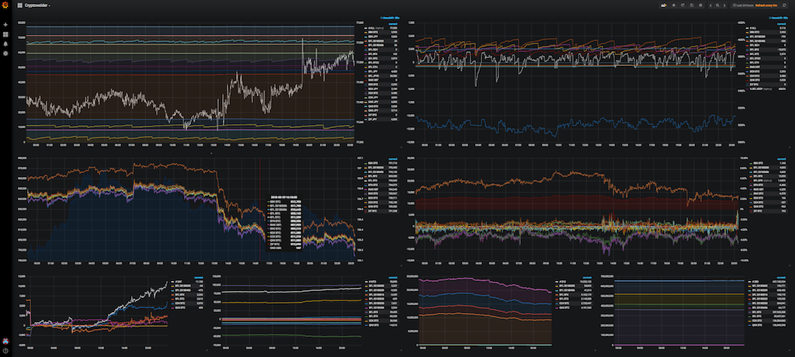

# cryptowelder
[![Build Status][travis-icon]][travis-page] [![Coverage Status][coverall-icon]][coverall-page]

[travis-page]:https://travis-ci.org/after-the-sunrise/cryptowelder
[travis-icon]:https://travis-ci.org/after-the-sunrise/cryptowelder.svg?branch=master
[coverall-page]:https://coveralls.io/github/after-the-sunrise/cryptowelder?branch=master
[coverall-icon]:https://coveralls.io/repos/github/after-the-sunrise/cryptowelder/badge.svg?branch=master

* :us: [English](./README.md)
* :jp: [日本語](./README_jp.md)

## Overview

**Cryptowelder** is a cryptocurrency trade monitoring application, 
for visualizing time series data of market prices, account balances, positions, volumes, profits and losses (P/L).




## Feature Highlights

### :zap: Time Series Data Visualization
Collect and display graphs/tables of various time series data.
* Market Prices
* Account Deposits and Collaterals
* Margin Positions and Unrealized P/L
* Daily/Monthly trading P/L
* Last N-days Traded Volumes

### :zap: Customizable Web UI & Notifications
Monitor trading activities from desktop and/or mobile through a standard web browser. 

Displayed data are continuously updated in real-time as they are being collected.
Time-frames of the displayed data can be specified on the fly, 
such as intra-day, last 24h, this week, last N days, or arbitrary time-points in the past from T1 to T2.

Visual components, such as graphs and tables, can be added with drag & drop from the web ui.
Each components are assigned grids, allowing customized layouts and dashboards.

Custom alerts/notifications can be configured for each the visual components in the dashboards. 
(cf: "[Slack](https://slack.com/) me if this indicator X touches the threshold value Y.")

### :zap: Multi-Currency, Multi-Exchange, Uniform Evaluation
Collect and store data from multiple exchanges, for multiple products and multiple currencies. 
All data sets can be displayed in an unified view, allowing cross-exchange and cross-product comparison and analysis.

Amounts denoted in various currency units (cf: JPY, USD, BTC, ETH, ...) are converted into a single home-currency unit (cf: JPY),
with dynamically configurable evaluation policy of which currency to convert into, and which conversion rates to apply.

### :zap: API Access
Direct access to the collected time series data with plain SQL (cf: [JDBC](https://jdbc.postgresql.org/), [ODBC](https://odbc.postgresql.org/)), 
without any special deserialization requirements.

[Prometheus Client](https://github.com/prometheus/client_python) is built-in for quick access to the latest data sets in plain text over HTTP.

[Grafana's HTTP API](http://docs.grafana.org/http_api/) can also be used to interact with dashboards and alerts.


## Getting Started

### Mechanics
The application consists of the following components *welded* together:
* Set of [Python](https://www.python.org/) scripts for scraping time-series data via public/private APIs.
* Relational database ([PostgreSQL](https://www.postgresql.org/)) for storing the time-series data.
* [Grafana](https://grafana.com/) for visualization and alerting of the time-series data.

### Prerequisites
* Linux machine with command line interface and direct internet access. Recommendation:
    * Cloud-hosted VM with SSH access. (cf: [AWS](https://aws.amazon.com/ec2/), [Azure](https://azure.microsoft.com/en-us/services/virtual-machines/), [GCE](https://cloud.google.com/compute/?hl=ja))
    * Modern linux operating system. (cf: [CentOS](https://www.centos.org/) 7.x x64)
    * 2GB or more memory.
    * 50GB or more disk space, preferably SSD.
* Python 3.x or later with pip. `pyenv` + `pyenv-virtualenv` are recommended.
* PostgreSQL 10.x or later.  
* Grafana 5.x or later installation. 
* Access tokens from each of the exchanges for private API access. 
* Basic knowledge/experience of Linux to install the applications.
* Basic knowledge/experience of Python and SQL to configure/customize the application. 

### Installation Steps
1. Install and configure PostgreSQL database instance.
    1. Create database `cryptowelder` with `UTC` timezone.
    2. Execute the [DDL](./etc/DDL.sql) and [DML](./etc/DML.sql) scripts.
    3. Create database user `grafana` and grant read-only access.
2. Configure and launch the Python scripts.
    1. Install pip requirements. (`pip install -r requirements.txt`)
    2. Prepare local configuration file (`~/.cryptowelder`), containing access tokens and scraping policies for each venues.
    3. Launch the script (`sh cryptowelder.sh`) to start collecting and storing data into the database. 
3. Install and configure Grafana instance.
    1. Configure Grafana users and security policies. ([localhost:3000](http://localhost:3000))
    2. Import the [preconfigured dashboard template](./etc/GRAFANA.json).
    
### Secure Access
Typically, multiple layers of security policies are preconfigured by default, which blocks access to Grafana from public internet.

A quick workaround is to use [SSH-tunneling](https://en.wikipedia.org/wiki/Tunneling_protocol#Secure_Shell_tunneling).
```
ssh -L 3000:localhost:3000 cryptowelder@my-virtual-machine
```

In order to allow direct access from public internet without SSH-tunneling, 
below are some of the setups recommended for secure access. 
* Disable root login and password login over SSH, and enforce public-key authentication.
* Configure firewall to accept inbound connections to Grafana's listen port, and bind Grafana's listen address from `localhost` to `0.0.0.0` (or to a specific network interface.)
* Purchase a custom domain (cf: [Google Domain](https://domains.google/)), obtain SSL certificate (cf: [Let’s Encrypt](https://letsencrypt.org/)), and switch Grafana's access protocol from `HTTP` to `HTTPS`.

Note that this list is **not comprehensive**. Contact your system administrator if you are not familiar with server securities in general.


## DISCLAIMER
Use at your own risk, following the [LICENSE](./LICENSE). 
Author has no plan to provide specific support for individual setups nor inquiries.
